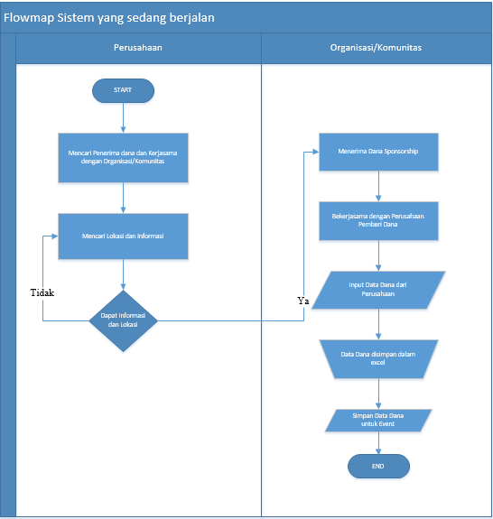

<h2 align="center">BAB III   ANALISIS DAN PERANCANGAN </h2>
<strong>3.1 Analisis</strong>
 
Tahap analisis adalah tahap pemahaman terhadap suatu aplikasi yang telah dibuat. Dalam tahap ini bertujuan untuk mengetahui sistem dari aplikasi tersebut, proses-proses yang terlibat dalam aplikasi serta hubungan antar proses. Analisis juga sebagai penguraian atau penjelasan dari sebuah aplikasi yang utuh kedalam bagian-bagian komponennya dengan maksud untuk mengidentifikasi dan mengevaluasi masalah-masalah, kesempatan-kesempatan, hambatan-hambatan yang terjadi serta kebutuhan yang diharapkan sehingga terdapat usulan untuk perbaikan.
Analisis adalah langkah awal untuk pengembangan aplikasi, karena perancangan dan pengembangan implementasi aplikasi tidak akan berjalan dengan baik tanpa adanya analisa terhadap aplikasi yang akan digunakan. Analisis juga dapat didefinisikan sebagai penguraian dari suatu sistem informasi yang utuh kedalam bagian-bagian komponennya dengan tujuan serta maksud untuk mengidentifikasi dan mengevaluasi masalah-masalah, kesempatan-kesempatan, hambatan-hambatan yang terjadi serta kebutuhan- kebutuhan yang diharapkan sehingga dapat diusulkan recovery atau perbaikan.
Langkah-langkah yang harus dilakukan dalam tahap analisis sistem, yaitu :
 
1.	Pengenalan atau identifikasi masalah, langkah ini merupakan langkah awal yang harus dilakukan, yaitu dengan mengidentifikasi permasalahan yang ada sehingga sasaran yang ingin dicapai dapat terlaksana.
 
2.	Memahami kerja dari sistem yang ada, langkah ini dilakukan dengan mempelajari secara rinci bagaimana jalannya sistem yang sudah ada.
 
3.	Menganalisis hasil penelitian, hal yang perlu diperhatikan dalam tahapan ini adalah menganalisis kebutuhan informasi pemakai sistem berdasarkan data yang diperoleh atas dasar hasil penelitian.
 
4.	Membuat laporan penelitian, merupakan tahap akhir yang disusun dalam suatu rangkuman dari langkah-langkah sebelumnya.

<strong>3.1.1	Analisis Sistem Yang Sedang Berjalan </strong> 
 
    &nbsp;&nbsp;&nbsp;3.1.1.1	Analisis Prosedur/Flowmap yang Berjalan

  

&nbsp;&nbsp;&nbsp;3.1.1.2 Analisis Dokumen yang digunakan

Dalam proses pembuatan Aplikasi Pencarian Sponsorship dan Partnership pada antara Organisasi/Komunitas Kampus dengan Perusahaan  (Sub Modul Pengelolaan Sponsor dari Perusahaan dan Partnership , ada beberapa dokumen dari Perusahaan yang terlibat dan digunakan, antara lain : 
1.	Dokumen Data Perusahaan
2.	Dokumen Data Dana Sponsorship.
3.	Dokumen Data Kerjasama dengan Organisasi/Komunitas Kampus

&nbsp;&nbsp;&nbsp;3.1.2.2 Analisis Kebutuhan Aplikasi
 
&nbsp;&nbsp;&nbsp;&nbsp;&nbsp;Aplikasi Pencarian Sponsorship dan Partnership pada antara Organisasi/Komunitas Kampus dengan Perusahaan  (Sub Modul Pengelolaan Sponsor dari Perusahaan dan Partnership ini dibuat untuk memudahkan para perusahaan dalam melakukan pencarian penerima dana dan partnership. Sistem yang dibuat ini dapat memberikan :
 
		1.Pengelolaan Data Perusahaan
         
		2.Pengelolaan Data Dana
         
		2.Pengelolaan Data Partnership

3.1.2.3	Analisis Kebutuhan Perangkat Lunak dan Perangkat Keras
 
3.1.2.3.1	Analisis Kebutuhan Perangkat Lunak
Spesifikasi perangkat lunak yang dibutuhkan adalah sebagai berikut :
 
Tabel 3.1 Spesifikasi Perangkat Lunak
 

No.|	Jenis	 |	Keterangan
------------ | ------------- | ------------- |
1	| Sistem Operasi	|	Microsoft Windows 10 Pro 64bit
2	| Bahasa Pemrograman 	|  Framework Laravel PHP,Java,Javascript Angular JS,  
3	| Database 	| 	MySQL,Firebase,Google Cloud Platform
4	| Perangkat Lunak	| 	Visual Studio Code, Atom , Android Studio IDE

3.1.3	Analisis Kebutuhan Perangkat Keras
Pembuatan Sistem Informasi ini menggunakan perangkat keras sebagai berikut:
 
Tabel 3.2 Spesifikasi Perangkat Keras
 

No| Jenis| Keterangan
------------ | ------------- | ------------- |
1 | Processor| Intel® core™i3 
2 | Memory | 4 GB
3 | Monitor | LCD 14,1 Inchi
4 | Mouse dan keyboard | LStandard

