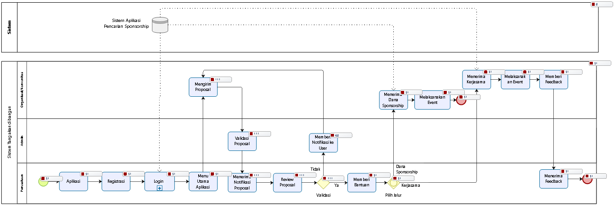

<h2 align="center">BAB III   ANALISIS DAN PERANCANGAN </h2>
<strong>3.1 Analisis</strong>
 
Tahap analisis adalah tahap pemahaman terhadap suatu aplikasi yang telah dibuat. Dalam tahap ini bertujuan untuk mengetahui sistem dari aplikasi tersebut, proses-proses yang terlibat dalam aplikasi serta hubungan antar proses. Analisis juga sebagai penguraian atau penjelasan dari sebuah aplikasi yang utuh kedalam bagian-bagian komponennya dengan maksud untuk mengidentifikasi dan mengevaluasi masalah-masalah, kesempatan-kesempatan, hambatan-hambatan yang terjadi serta kebutuhan yang diharapkan sehingga terdapat usulan untuk perbaikan.
Analisis adalah langkah awal untuk pengembangan aplikasi, karena perancangan dan pengembangan implementasi aplikasi tidak akan berjalan dengan baik tanpa adanya analisa terhadap aplikasi yang akan digunakan. Analisis juga dapat didefinisikan sebagai penguraian dari suatu sistem informasi yang utuh kedalam bagian-bagian komponennya dengan tujuan serta maksud untuk mengidentifikasi dan mengevaluasi masalah-masalah, kesempatan-kesempatan, hambatan-hambatan yang terjadi serta kebutuhan- kebutuhan yang diharapkan sehingga dapat diusulkan recovery atau perbaikan.
Langkah-langkah yang harus dilakukan dalam tahap analisis sistem, yaitu :
 
1.	Pengenalan atau identifikasi masalah, langkah ini merupakan langkah awal yang harus dilakukan, yaitu dengan mengidentifikasi permasalahan yang ada sehingga sasaran yang ingin dicapai dapat terlaksana.
 
2.	Memahami kerja dari sistem yang ada, langkah ini dilakukan dengan mempelajari secara rinci bagaimana jalannya sistem yang sudah ada.
 
3.	Menganalisis hasil penelitian, hal yang perlu diperhatikan dalam tahapan ini adalah menganalisis kebutuhan informasi pemakai sistem berdasarkan data yang diperoleh atas dasar hasil penelitian.
 
4.	Membuat laporan penelitian, merupakan tahap akhir yang disusun dalam suatu rangkuman dari langkah-langkah sebelumnya.

<strong>3.1.1	Analisis Sistem Yang Sedang Berjalan </strong> 
 
    &nbsp;&nbsp;&nbsp;3.1.1.1	Analisis Prosedur/Flowmap yang Berjalan

  

<h4 align="center">Proses yang sedang berjalan</h4>

 

  

<h4 align="center">Laporan BPMN Proses yang sedang berjalan </h4>

&nbsp;&nbsp;&nbsp;

3.1.1.2 Analisis Dokumen yang digunakan

Dalam proses pembuatan Aplikasi Pencarian Sponsorship dan Partnership pada antara Organisasi/Komunitas Kampus dengan Perusahaan  (Sub Modul Pengelolaan Sponsor dari Perusahaan dan Partnership , ada beberapa dokumen dari Perusahaan yang terlibat dan digunakan, antara lain : 
 
1.	Dokumen Data Perusahaan
 
2.	Dokumen Data Penerima Dana Sponsorship.
 
3.	Dokumen Data Kerjasama dengan Organisasi/Komunitas Kampus

&nbsp;&nbsp;&nbsp;3.1.2	Analisis Sistem  yang akan dibangun
 
&nbsp;&nbsp;&nbsp;Analisis Prosedur/Flow Map yang dibangun
 

  

<h4 align="center">Bisnis prosses yang akan dibangun</h4>

 

  

<h4 align="center">Laporan BPMN Proses yang akan dibangun </h4>

 

  

<h4 align="center">Laporan BPMN Sub Proses Login </h4>

 

  

<h4 align="center">Sub Login</h4>

&nbsp;&nbsp;&nbsp;3.1.2.2 Analisis Kebutuhan Aplikasi
 
&nbsp;&nbsp;&nbsp;&nbsp;&nbsp;Aplikasi Pencarian Sponsorship dan Partnership pada antara Organisasi/Komunitas Kampus dengan Perusahaan  (Sub Modul Pengelolaan Sponsor dari Perusahaan dan Partnership ini dibuat untuk memudahkan para perusahaan dalam melakukan pencarian penerima dana dan partnership. Sistem yang dibuat ini dapat memberikan :
 
		1.Pengelolaan Data Perusahaan
         
		2.Pengelolaan Data Dana
         
		2.Pengelolaan Data Partnership

3.1.2.3	Analisis Kebutuhan Perangkat Lunak dan Perangkat Keras
 
3.1.2.3.1	Analisis Kebutuhan Perangkat Lunak
Spesifikasi perangkat lunak yang dibutuhkan adalah sebagai berikut :
 
Tabel 3.1 Spesifikasi Perangkat Lunak
 

No.|	Jenis	 |	Keterangan
------------ | ------------- | ------------- |
1	| Sistem Operasi	|	Microsoft Windows 10 Pro 64bit
2	| Bahasa Pemrograman 	|  Framework Laravel PHP,Java,Javascript,Angular JS, Node JS, Express JS 
3	| Database 	| 	MySQL,Firebase,Google Cloud Platform
4	| Perangkat Lunak	| 	Visual Studio Code, Atom , Android Studio IDE

3.1.3	Analisis Kebutuhan Perangkat Keras
Pembuatan Sistem Informasi ini menggunakan perangkat keras sebagai berikut:
 
Tabel 3.2 Spesifikasi Perangkat Keras
 

No| Jenis| Keterangan
------------ | ------------- | ------------- |
1 | Processor| Intel® core™i3 
2 | Memory | 4 GB
3 | Monitor | LCD 14,1 Inchi
4 | Mouse dan keyboard | Standard

3.2	Perancangan
 
3.2.1	Use Case Diagram
Diagram Use Case dari aplikasi  ini adalah sebagai berikut :

  

<h4 align="center">Use Case Diagram</h4>

Tabel 3.3. Definisi Aktor 

No| Aktor| Keterangan
------------ | ------------- | -------------
1 |	Anggota Perusahaan | Anggota dari Perusahaan yang akan memberikan dana sebagai Member mempunyai hak akses untuk mereview proposal dan memberikan bantuan pendanaan dan bantuan Opsional.
2 |	Admin |	Mempunyai hak akses untuk memvalidasi syarat pendaftaran baik Perusahaan maupun Organisasi dan Distribusi Proposal
3 |	Organisasi |	Pengguna dari Organisasi yang mempunyai hak akses Mengirim Proposal dan Menerima Bantuan dari Perusahaan.
 

Tabel 3.4. Definisi Use Case 

No| Aktor| Keterangan
------------ | ------------- | -------------
1 |	UC-01 Registrasi | Mendaftarkan Perusahaan beserta persyaratannya
2	| UC-02 Login |	Proses Login
3	| UC-03 Kelola Proposal |	Menerima Proposal yang dikirim dari Organisasi
4	| UC-04 Review Proposal |	Mereview Proposal yang telah masuk ke perusahaan
5 |	UC-05 Beri Bantuan |	Memberikan Bantuan berupa dana setelah mereview proposal
6 |	UC-06 Beri Opsional |	Memberikan bantuan selain dana yaitu kerjasama atau penjualan produk dari perusahaan
7 |	UC-07 Validasi Persyaratan |	Memeriksa persyaratan pendaftaran dan validasi baik dari perusahaan maupun organisasai
8 |	UC-08 Distribusi Proposal |	Mengirim Proposal Proposal yang sudah divalidasi oleh admin ke perusahaan yang dituju
9 |	UC-09 Kirim Proposal |	Anggota dari Organisasi mengajukan proposal.
10 |	UC-10 Terima Bantuan |	Organisasi yang akan mengadakan suatu acara akan menerima bantuan dari Perusahaan jika proposal sudah diterima.
 

<h4 align="center">3.2.1.1	Skenario Use Case</h4>
 

  

<h4 align="center">Use Case Registrasi</h4>

Tabel 3.5 Skenario Use Case Registrasi 

Identifikasi| ...
------------ | -------------
Nomor | UC-01 
Nama | Registrasi
Tujuan | Melakukan pendataan dan validitias perusahaan
Deskripsi	| Mendaftar sebagai anggota perusahaan di sistem aplikasi
Aktor	| Anggota Perusahaan
Skenario | 
Kondisi Awal | Menampilkan halaman utama lalu pilih registrasi
Aksi | Aktor	Reaksi Sistem
1. Aktor meminta halaman registrasi |	2. Menampilkan halaman registrasi
3.Memasukan Identitas diri dan perusahaan	| 4. Melakukan proses validasi

 
Tabel 3.6 Skenario Use Case Login 

Identifikasi| ...
------------ | -------------
Nomor |	UC-02 
Nama | Login
Tujuan |	Melakukan login untuk masuk halaman utama
Deskripsi |	Login dengan memasukan Username dan Password
Aktor |	Anggota Perusahaan, Admin , Organisasi
Skenario |
Kondisi Awal | Menampilkan form login
Aksi | Aktor	Reaksi Sistem
1.    Aktor meminta fasilitas login kepada sistem |	2.     Menampilkan form login
3.    Memasukan Username dan Password	| 4. Melakukan proses validasi jika salah keduanya muncul pesan “Username dan Password yang anda masukan tidak cocok”.
5. Jika masih salah, kembali ke form login. | 6. Jika benar maka akan ditampilkan form halaman utama Kondisi Akhir	Menampilkan form halaman utama

 
Tabel 3.7 Skenario Use Case UC-03 Kelola Proposal 

Identifikasi| ...
------------ | -------------
Nomor	| UC-03
Nama |	Kelola Proposal
Tujuan |	Melihat proposal yang masuk ke perusahaan yang sudah diperiksa dan dinilai oleh admin.
Deskripsi |	Perusahaan menerima proposal dari organisasi yang telah divalidasi oleh admin melalui sistem 
Aktor |	Anggota Perusahaan
Skenario |
Kondisi Awal |	Menampilkan halaman dashboard perusahaan lalu ada notifikasi proposal masuk yang telah diperiksa oleh admin.
Aksi | Aktor	Reaksi Sistem
1.Meminta halaman notifikasi proposal masuk	| 2.Menampilkan halaman notifikasi proposal

 
Tabel 3.7 Skenario Use Case Review Proposal 

Identifikasi| ...
------------ | -------------
Nomor	| UC-04
Nama	| Review Proposal
Tujuan |	Melakukan penilaian dan mereview proposal dari organisasi,
Deskripsi	| Proposal yang sudah masuk ke perusahaan akan direview langsung oleh anggota kemudian perusahaan memberikan keputusan hasil review
Aktor	| Anggota Perusahaan
Skenario |
Kondisi Awal |	Menampilkan halaman pemberitahuan proposal masuk kemudian pilih review proposal 
Aksi | Aktor 	Reaksi Sistem
1.Meminta halaman pemberitahuan proposal masuk	| 2. Menampilkan halaman pemberitahuan proposal masuk
3. Mereview proposal	| 4.Menampilkan halaman review proposal
5. Meminta halaman kirim hasil proposal ke organisasi. | 6. Menampilkan halaman pengiriman proposal

 
Tabel 3.8 Skenario Use Case Beri Bantuan Dana 

Identifikasi| ...
------------ | -------------
Nomor	| UC-05
Nama	| Beri Bantuan Dana
Tujuan	| Memberikan bantuan berupa dana ketika proposal sudah diterima oleh perusahaan
Deskripsi	| Perusahaan akan memberikan bantuan berupa dana yang sesuai diajukan oleh organisasi
Aktor	| Anggota Perusahaan
Skenario |
Kondisi Awal	| Menampilkan halaman kirim dana untuk event dari organisasi.
Aksi | Aktor	Reaksi Sistem
1.Meminta halaman pengiriman dana dan meminta nama organisasi yang akan diberi dana. |	2.Menampilkan halaman Data Pengiriman Dana
3. Masukan dana yang akan dikirim	 | 4. Menampilkan halaman pendanaan  
5. Mengirim Jumlah dana dan diproses oleh admin kemudian diteruskan ke Organisasi melalui Nomor Rekening Organisasi yang telah didaftarkan sendiri oleh Organisasi | 6.Menampilkan halaman pengiriman dana.

 
Tabel 3.9 Skenario Use Case Bantuan Kerjasama 

Identifikasi| ...
------------ | -------------
Nomor	| UC-06
Nama	| Bantuan Kerjasama
Tujuan	| Memberikan bantuan pilihan lain yaitu berupa kerjasama dengan organisasi
Deskripsi	| Perusahaan akan memberikan bantuan berupa kerjasama untuk mempromosikan produk perusahaan atau menjual produk perusahaan
Aktor	| Anggota Perusahaan
Skenario |
Kondisi Awal	| Menampilkan halaman bantuan kerjasama
Aksi | Aktor	Reaksi Sistem
1.Meminta halaman bantuan kerjasama	| 2.Menampilkan halaman bantuan kerjasama
3. Masukan jenis kerjasama 	| 4. Menampilkan halaman Jenis Kerjasama
5. Mengirim jenis bantuan kerjasama ke perusahaan | 6.Menampilkan halaman proses kerjasama

 
Tabel 3.10 Skenario Use Case Validasi Syarat 

Identifikasi| ...
------------ | -------------
Nomor	| UC-07
Nama	| Validasi Syarat
Tujuan	| Mengecek kelengkapan proposal
Deskripsi	| Admin mengecek kelengkapan proposal yang diajukan anggota
Aktor	| Admin
Skenario |
Kondisi Awal	| Menampilkan halaman utama aplikasi, lalu muncul notifikasi
Aksi | Aktor	Reaksi Sistem
1.	Periksa kelengkaapan, pilih button tolak	| 2.  Menampilkan notifikasi ke anggota, dan mengirim pesan bahwa proposal anda tidak lengkap serta alasannya.
3.  Apabila lengkap, pilih button terima	| 4.  Masuk ke menu distribusi proposal

 
Tabel 3.10 Skenario Use Case distribusi proposal 

Identifikasi| ...
------------ | -------------
Nomor	| UC-08
Nama	| Mendistribusikan proposal
Tujuan	| Mengirimkan proposal ke perusahaan
Deskripsi	| Admin memilih perusahaan yang akan dikirim proposal 
Aktor	| Admin
Skenario |
Kondisi Awal	| Menu distribusi proposal
Aksi | Aktor	Reaksi Sistem
1.	Pilih perusahaan yang akan dikirim proposal, lalu kirimkan	| 2  Mengirimkan file proposal ke perusahaan yang dituju.

 
Tabel 3.11  Skenario Use Case Kirim proposal 

Identifikasi| ...
------------ | -------------
Nomor	| UC-09
Nama	| Kirim proposal
Tujuan |	Mengajukan proposal untuk mengadakan event
Deskripsi	| Mengirimkan proposal ke admin untuk di validasi syarat-syaratnya, apabila valid maka dikirim ke perusahaan untuk direview.
Aktor	| Organisasi
Skenario |
Kondisi Awal |	Menampilkan halaman utama pilih ajukan proposal
Aksi | Aktor	Reaksi Sistem
1.	Meminta halaman ajukan proposal	| 2. Menampilkan halaman yang diminta
3.  Masukan proposal 	| 4.  Menampilkan notifikasi proposal sudah dikirim

 
Tabel 3.12  Skenario Use Case Terima Bantuan 

Identifikasi| ...
------------ | -------------
Nomor |	UC-10
Nama | Terima Bantuan
Tujuan |	Menerima Bantuan dari Perusahaan
Deskripsi	| Organisasi menerima bantuan dari perusahaan setelah proposal diterima
Aktor |	Organisasi
Skenario |
Kondisi Awal |	Menampilkan halaman utama pemberitahuan bantuan masuk
Aksi | Aktor	Reaksi Sistem
1.Meminta halaman bantuan masuk |	2. Menampilkan halaman bantuan masuk
3.Meminta halaman proses penerimaan bantuan |	4. Menampilkan proses penerimaan bantuan
