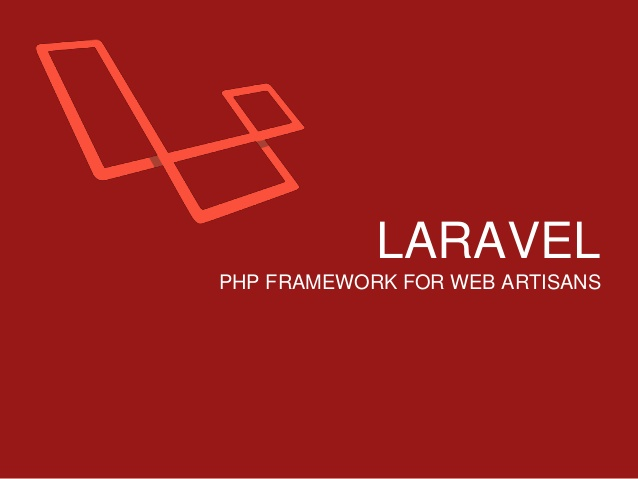

<h2 align="center">BAB II   LANDASAN TEORI</h2>

<strong>2.1.	Pengertian Perancangan</strong>

&nbsp;&nbsp;&nbsp;&nbsp;Perancangan adalah suatu proses yang bertujuan untuk menganalisis, menilai memperbaiki dan menyusun suatu sistem, baik sistem fisik maupun non fisik yang optimum untuk waktu yang akan datang dengan memanfaatkan informasi yang ada.[1]

 
<strong>2.2.	Pengertian Implementasi</strong>

&nbsp;&nbsp;&nbsp;&nbsp;Implementasi bermuara pada aktivitas, adanya aksi, tindakan, atau mekanisme suatu sistem. Ungkapan mekanisme mengandung arti bahwa implementasi bukan sekadar aktivitas, tetapi suatu kegiatan yang terencana dan dilakukan secara sungguh sungguh berdasarkan acuan norma tertentu untuk mencapai tujuan kegiatan. Oleh karena itu, implementasi tidak berdiri sendiri tetapi dipengaruhi oleh obyek berikutnya yaitu kurikulum.[2]

 
<strong>2.3.	Pengertian Aplikasi</strong>

&nbsp;&nbsp;&nbsp;&nbsp;Aplikasi adalah suatu subkelas perangkat lunak komputer yang memanfaatkan kemampuan komputer langsung untuk melakukan suatu tugas yang diinginkan pengguna. Biasanya dibandingkan dengan perangkat lunak sistem yang mengintegrasikan berbagai kemampuan komputer, tapi tidak secara langsung menerapkan kemampuan tersebut untuk mengerjakan suatu tugas yang menguntungkan pengguna. Contoh utama perangkat lunak aplikasi adalah pengolah kata, lembar kerja, dan pemutar media.[3]

 
<strong>2.4.	Pengertian Sponsorship</strong>

&nbsp;&nbsp;&nbsp;&nbsp;Sponsorship dapat didefinisikan sebagai perubahan dalam penyediaan bantuan terhadap organisasi,atau komunitas yang ingin membuat event. Bantuan tersebut dapat berbentuk uang atau dalam bentuk apapun. Untuk sebuah kegiatan(misalnya olahraga,acara musik, festival atau seni) dalam mencapai tujuan.[4]

 
<strong>2.5.	Pengertian Partnership</strong>

Partnership berasal dari akar kata yaitu partner. Partner dapat diterjemahkan sebagai pasangan, sekutu, atau kompanyon, sedangkan partnership diterjemahkan sebagai persekutuan atau perkongsian. Berdasarkan terjemahan asal katanya dapat dimaknai sebagai suatu bentuk persekutuan antara dua pihak atau lebih yang membentuk suatu ikatan kerjasama atas dasar kesepakatan dan saling membutuhkan.[5]

 
<strong>2.6.	Pengertian Organisasi</strong>

Organisasi adalah sebuah unit sosial yang dikoordinasikan secara sadar, terdiri atas dua orang atau lebih dan yang relatif terus-menerus guna mencapai satu atau serangkaian tujuan bersama. Organisasi tanpa manajemen yang baik akan mengakibatkan rutinitas organisasi tidak dapat bertahan lama.[6]

 
<strong>2.7.	Pengertian Perusahaan</strong>

Pengertian perusahaan menurut UU[4] No. 8 Pasal 1 ayat 1 tahun 1997 adalah setiap bentuk usaha yang melakukan kegiatan secara tetap dan terus menerus dengan tujuan memperoleh keuntungan dan atau laba, baik yang diselenggarakan oleh orang-perorangan maupun badan usaha yang berbentuk badan hukum atau bukan badan hukum, yang didirikan dan berkedudukan dalam wilayah Negara Republik Indonesia.

 
<strong>2.8.	Pengertian PHP</strong>

PHP adalah bahasa open source yang dapat digunakan di berbagai mesin (Linux, Unix, Macintosh, Windows) dan dapat dijalankan secara runtime melalui console serta juga dapat menjalankan perintah-perintah system. Dalam sisi pemahamanan, PHP adalah bahasa scripting yang paling mudah karena memiliki referensi yang banyak.

 
<strong>2.9.	Pengertian RDBMS</strong>

MySQL adalah Relational Database Management System (RDBMS)[5] yang didistribusikan secara gratis dibawah lisensi GPL (General Public License). Dimana setiap orang bebas untuk menggunakan MySQL, namun tidak boleh dijadikan produk turunan yang bersifat komersial. MySQL sebenarnya merupakan turunan salah satu konsep utama dalam database sejak lama, yaitu SQL (Structured Query Language). SQL adalah sebuah konsep pengoperasian database, terutama untuk pemilihan atau seleksi dan pemasukan data, yang memungkinkan pengoperasian data dikerjakan dengan mudah secara otomatis.

 
<strong>2.10.	Pengertian UML</strong>

UML adalah sebuah bahasa standard untuk pengembangan sebuah software yang dapat menyampaikan bagaimana membuat dan membentuk model-model, tetapi tidak menyampaikan apa dan kapan model yang seharusnya dibuat yang merupakan salah satu proses implementasi pengembangan software.

 
<strong>2.11.	Pengertian Laravel</strong>

Laravel adalah framework PHP dengan kode terbuka (open source) dengan desain MVC (Model-View-Controller) yang digunakan untuk membangun aplikasi website. Framework ini pertama kali dibangun oleh Taylor Otwell pada tanggal 22 Pebruari 2012.[10]

  

 
<strong>2.11.	Pengertian Model View Controller</strong>

Model-View-Controller atau MVC adalah sebuah metode untuk membuat sebuah aplikasi dengan memisahkan data (Model) dari tampilan (View) dan cara bagaimana memprosesnya (Controller).

 
